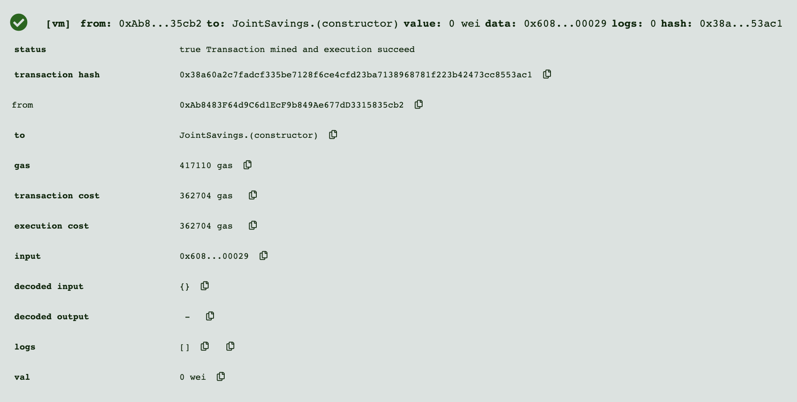
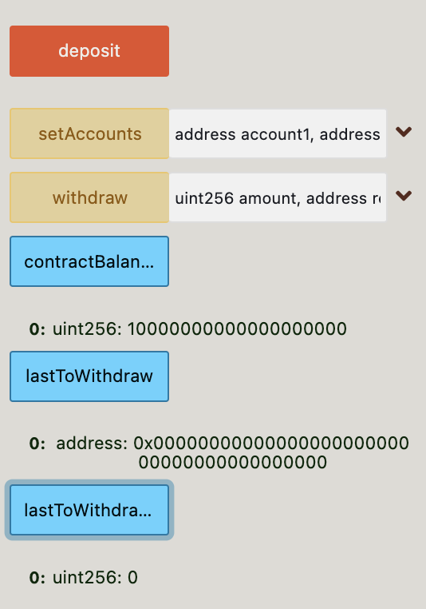
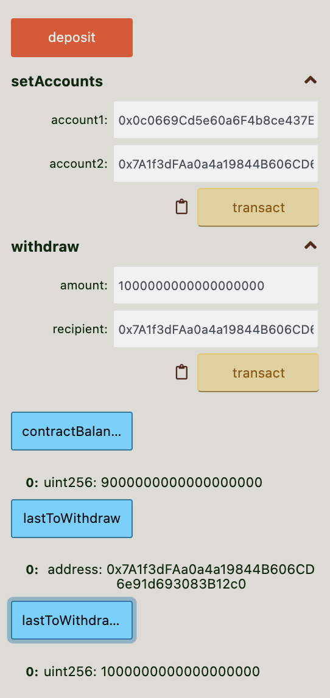
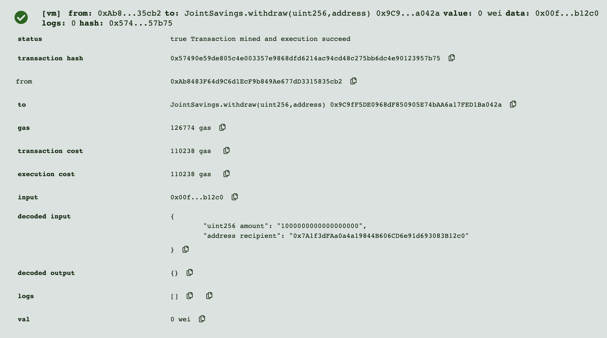

# User Friendly Ledger

> A joint savings contract
* [Contract Deployment](#contract-deployment)
* [Withdrawing](#withdrawing)

---

## Technologies

Solidity version ^0.5.0 
* [Remix IDE](https://remix-project.org/)

---

## Contract Deployment

Initially the contract will have zero wei to use. The deposit function is used to add ether from the adrress the contract was deployed from. For the demonstration I deposited ten ether.

---

## Withdrawing

Set the adresses and choose which address will recive the wei from the contract. 

The contract balance is then upadated and the chosen account will now have the chosen amount of wei.

---

## Contributors

Main contributer **Santiago Hernandez**
- [dsmannight@gmail.com](dsmannight@gmail.com)

---

## License

This application is free for non-profit use.
